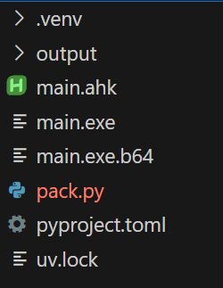

# exe嵌入python


```python
# pack.py
from subprocess import run
import os,sys,shlex
BASE_DIR = os.path.dirname(os.path.realpath(sys.argv[0]))
cmd = os.path.join(BASE_DIR,'main.exe')
run(shlex.split(cmd))
```

```autohotkey
; main.ahk
#SingleInstance Force
MsgBox('hello')
```





我们要做的事情就是要把，用ahk编译出来的```main.exe``` ，嵌入到 ```pack.py``` 中，运行 ```pack.py``` 的时候就运行 ```main.exe``` 最后把 ```pack.py``` 给打包成 exe 就好了
> 以下是通义给的答案

你想要将 `main.exe` 嵌入到 `pack.py` 中，然后用 PyInstaller 打包成一个独立的可执行文件（比如单个 `.exe`），在运行时能释放并调用这个嵌入的 `main.exe`。这是一个常见的“打包资源”需求。

下面是实现这一目标的完整方案：

---

### ✅ 目标
- 将 `main.exe` 作为**二进制资源**嵌入 Python 脚本中。
- 使用 PyInstaller 打包成单个 `.exe` 文件。
- 运行时自动释放 `main.exe` 到临时目录，并执行它。
- 不需要用户手动管理外部文件。

---

### ✅ 步骤一：修改 `pack.py`，支持从内嵌资源释放 exe

```python
# pack.py

import os
import sys
import tempfile
import atexit
import subprocess
from pathlib import Path

# ==============================
# 内嵌 main.exe 的二进制数据（Base64 编码更安全）
# ==============================
import base64

# 这里会存放 main.exe 的 base64 编码内容
EMBEDDED_EXE_DATA = b"""
TVqQAAMAAAAEAAAA//8AALgAAAAAAAAAQAAAWAAAAAAAAAAA4AAAAAAAAAAAAAAA
...（大量 base64 数据）
"""
# 注意：这是占位符，你需要用真实数据替换


def extract_exe_to_temp():
    """将内嵌的 EXE 数据释放到临时文件"""
    # 创建临时文件，不自动删除，由我们控制生命周期
    temp_file = tempfile.NamedTemporaryFile(suffix='.exe', delete=False)
    temp_path = temp_file.name
    temp_file.close()  # 关闭句柄以便后续写入

    try:
        # 解码并写入 EXE 文件
        exe_data = base64.b64decode(EMBEDDED_EXE_DATA)
        with open(temp_path, 'wb') as f:
            f.write(exe_data)
        print(f"已释放 main.exe 到: {temp_path}")

        # 注册退出时清理
        atexit.register(lambda: safe_remove(temp_path))

        return temp_path

    except Exception as e:
        print(f"释放 main.exe 失败: {e}")
        safe_remove(temp_path)  # 出错也尝试清理
        return None


def safe_remove(path):
    """安全删除临时文件"""
    try:
        if os.path.exists(path):
            os.unlink(path)
    except:
        pass


def run_embedded_exe():
    """主逻辑：释放并运行内嵌的 main.exe"""
    exe_path = extract_exe_to_temp()
    if not exe_path:
        print("无法释放 main.exe，程序退出。")
        sys.exit(1)

    # 执行 main.exe，等待其完成
    try:
        result = subprocess.run([exe_path], shell=False)
        sys.exit(result.returncode)
    except Exception as e:
        print(f"执行 main.exe 时出错: {e}")
        sys.exit(1)


if __name__ == '__main__':
    run_embedded_exe()
```

---

### ✅ 步骤二：生成 `main.exe` 的 Base64 数据

创建一个脚本或命令来把你的 `main.exe` 转换成 base64 字符串，并插入到上面的 `pack.py` 中。

#### 方法一：使用命令行（推荐）

```bash
# Linux/macOS
base64 -i main.exe -o main.exe.b64

# Windows（PowerShell）
[Convert]::ToBase64String([IO.File]::ReadAllBytes("main.exe")) | Out-File -Encoding ASCII main.exe.b64
```

然后复制 `main.exe.b64` 的内容，替换 `pack.py` 中的 `EMBEDDED_EXE_DATA`。

#### 方法二：用 Python 自动生成代码片段

```python
# gen_code.py
import base64

with open('main.exe', 'rb') as f:
    data = f.read()

b64_str = base64.b64encode(data).decode('ascii')

print(f'EMBEDDED_EXE_DATA = b"""{b64_str}"""')
```

运行后输出类似：

```
EMBEDDED_EXE_DATA = b"TVqQAAMAAAAEAAAA..."
```

复制这行替换到 `pack.py` 即可。

---

### ✅ 步骤三：使用 PyInstaller 打包

确保你已经安装了 PyInstaller：

```bash
pip install pyinstaller
```

执行打包命令（**单文件模式**）：

```bash
pyinstaller --onefile pack.py
```

> ⚠️ 提示：
> - 因为 `main.exe` 已经被编码进 `pack.py`，所以不需要再通过 `--add-data` 添加它。
> - 打包过程可能会比较慢，因为整个 `main.exe` 被当作字符串包含在代码中。

---

### ✅ 可选优化建议

1. **压缩数据（可选）**
   如果 `main.exe` 很大，可以先压缩再编码，运行时解压：

   ```python
   import zlib
   compressed_data = zlib.compress(exe_data)
   # 存储 compressed_data 的 base64
   # 读取时：zlib.decompress(base64.b64decode(...))
   ```

2. **避免被杀毒软件误报**
   - 某些杀软会对“Python 程序释放 exe”行为敏感。
   - 可尝试加壳、签名，或使用其他打包方式（如 NSIS + 自解压）。

3. **隐藏控制台（如果是 GUI 程序）**

   ```bash
   pyinstaller --onefile --windowed pack.py
   ```

---

### ✅ 最终效果

- 输出一个 `dist/pack.exe`
- 运行 `pack.exe` 时：
  - 自动释放 `main.exe` 到 `%TEMP%` 目录
  - 执行 `main.exe`
  - 退出时自动清理临时文件

---

### ❗注意事项

- `EMBEDDED_EXE_DATA` 是纯文本，会使 `pack.py` 文件变得非常大（和 `main.exe` 大小相当）。
- 如果 `main.exe` 经常更新，每次都要重新生成 `pack.py`，不太方便。此时可考虑用构建脚本自动化。
- 某些反病毒软件可能对“内存/临时释放 exe”的行为发出警告。

---

